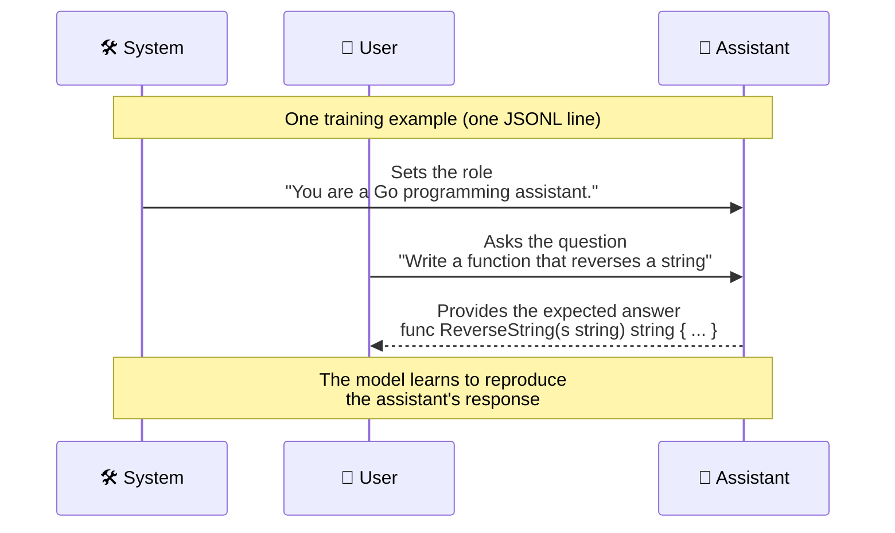

# DonkeyTune
> Fine-tuning de petits LLMs sur Apple Silicon

```
       \    /
        \__/        
        (oo)\_______
        (__)\       )\/\
            ||-----|| 
v0.0.0      ||     ||
```


DonkeyTune est pipeline complet (un ensemble de scripts) pour fine-tuner des modèles sur MacBook Air/Pro M1/M2/M3/M4, avec export au format GGUF utilisables ensuite avec Docker Model Runner, llama.cpp, Ollama, ou tout outil compatible.

> **Notes**:
> - Sur un MacBook Air M4 32 GB, j'ai pu fine-tuner confortablement un modèle de 4 milliards de paramètres.
> - 🐣 ce sont mes baby steps en fine-tuning

🔥 Si vous ne voulez pas tout lire, vous pouvez tenter le [QUICKSTART.md](./QUICKSTART.md)

## Comment ça marche

Le fine-tuning est réalisé avec **LoRA** (Low-Rank Adaptation) via **mlx-lm**, le framework d'Apple optimisé pour Apple Silicon. LoRA ne modifie pas directement les poids du modèle : il entraîne de petites matrices "adaptateurs" qui viennent se greffer sur le modèle existant. C'est ce qui rend le fine-tuning possible sur un laptop avec peu de mémoire.

Le pipeline complet se déroule en 4 étapes :

```
Modèle HuggingFace + Dataset JSONL
        │
        ▼
   ┌─────────────┐
   │  fine-tune  │  mlx_lm.lora : entraîne des adapters LoRA
   └──────┬──────┘
          ▼
   ┌─────────────┐
   │    fuse     │  mlx_lm.fuse : fusionne adapters + modèle de base
   └──────┬──────┘
          ▼
   ┌─────────────┐
   │  convert    │  convert_hf_to_gguf.py : safetensors → GGUF f16
   └──────┬──────┘
          ▼
   ┌─────────────┐
   │  quantize   │  llama-quantize : GGUF f16 → GGUF Q4_K_M (plus petit)
   └──────┬──────┘
          ▼
    Fichier GGUF prêt pour Docker Model Runner, llama.cpp, Ollama, etc.
```

## Prérequis

- **macOS** sur Apple Silicon (M1, M2, M3, M4)
- **Python 3.10+** — `setup.sh` détecte automatiquement la bonne version ; si `python3` pointe vers Python 3.9 (défaut Xcode CLT), installez une version plus récente : `brew install python@3.12`
- **Homebrew** (pour installer cmake)
- **cmake** : `brew install cmake`
- **git**
- Environ **5 Go d'espace disque** (pour le venv, llama.cpp et les modèles)

Vérifiez votre architecture :

```bash
uname -m
# Doit afficher : arm64
```

## Installation

```bash
git clone https://github.com/donkey-labs/donkeytune.git
cd donkeytune
make setup
```

Le script `setup.sh` installe automatiquement :

| Composant | Rôle |
|-----------|------|
| `.venv/` | Virtual environment Python isolé |
| `mlx-lm` | Framework Apple MLX pour fine-tuning et inférence |
| `torch` | PyTorch (nécessaire pour la conversion GGUF) |
| `gguf`, `numpy`, `sentencepiece` | Dépendances de conversion |
| `llama.cpp/` | Cloné et compilé localement (pour `llama-quantize` et `convert_hf_to_gguf.py`) |
| `data/`, `output/` | Répertoires de travail |

> Selon les machines, l'installation prend environ 5 minutes (téléchargement + compilation).

### Token HuggingFace (optionnel)

Certains modèles sur HuggingFace sont protégés (gated models) et nécessitent un token d'accès. D'autres sont publics mais le token permet d'éviter les limites de téléchargement.

Créez un fichier `.env` à la racine du projet :

```bash
HF_TOKEN=hf_votre_token_ici
```

Vous pouvez obtenir votre token sur [huggingface.co/settings/tokens](https://huggingface.co/settings/tokens).

Les scripts chargent automatiquement ce fichier à chaque exécution. Le `.env` est exclu du dépôt git via `.gitignore`.

## Préparer le dataset

Pour fine-tuner un modèle, vous devez lui fournir des exemples d'entraînement : des paires question/réponse qui montrent au modèle ce que vous attendez de lui. Ces exemples sont organisés dans un dataset au format JSONL.

### Format des fichiers

Le dataset doit être au format **JSONL** (JSON Lines : un objet JSON par ligne). Chaque ligne représente un **exemple d'entraînement** au format chat, avec exactement 3 messages :

```json
{
  "messages": [
    {
      "role": "system",
      "content": "You are a Go programming assistant."
    },
    {
      "role": "user",
      "content": "Write a function that reverses a string"
    },
    {
      "role": "assistant",
      "content": "func ReverseString(s string) string {\n\trunes := []rune(s)\n\tfor i, j := 0, len(runes)-1; i < j; i, j = i+1, j-1 {\n\t\trunes[i], runes[j] = runes[j], runes[i]\n\t}\n\treturn string(runes)\n}"
    }
  ]
}
```

> **Rappel** : dans le fichier `.jsonl`, chaque exemple reste sur **une seule ligne**. Le format ci-dessus est affiché en pretty-print pour faciliter la lecture.



| Rôle | Contenu | Conseils |
|------|---------|----------|
| `system` | Instruction de comportement | **Identique** dans tous les exemples. Définit la personnalité du modèle. |
| `user` | La question / demande en langage naturel | Variez les formulations pour que le modèle généralise. |
| `assistant` | La réponse attendue (le code, l'explication, etc.) | C'est ce que le modèle apprend à reproduire. Soignez la qualité. |

> **Important** : chaque ligne est un JSON complet sur une seule ligne. Pas de retour à la ligne entre les accolades. Les retours à la ligne *dans* le code doivent être encodés en `\n` et les tabulations en `\t`.

### Les deux fichiers : train.jsonl et valid.jsonl

```
data/
├── train.jsonl    # Training samples
└── valid.jsonl    # Validation samples
```

**`train.jsonl`** — Le fichier d'entraînement. C'est le cœur du dataset : le modèle apprend à partir de ces exemples. À chaque itération du fine-tuning, un batch d'exemples est tiré de ce fichier, et le modèle ajuste ses poids pour mieux reproduire les réponses attendues.

**`valid.jsonl`** — Le fichier de validation. Ces exemples ne sont **jamais utilisés pour l'entraînement**. Le modèle est évalué dessus périodiquement (toutes les 50 itérations par défaut) pour calculer la **validation loss**. C'est un indicateur indispensable :

- Si la validation loss **diminue** en même temps que la training loss → le modèle **apprend** et généralise bien.
- Si la validation loss **monte** alors que la training loss descend → c'est de l'**overfitting** : le modèle mémorise les exemples d'entraînement au lieu d'apprendre les patterns. Il faut alors réduire le nombre d'itérations ou augmenter le dataset.

Sans fichier de validation, vous n'avez aucun moyen de savoir si le modèle généralise ou s'il mémorise.

### Comment construire son dataset

**1. Définir le system prompt**

Choisissez une instruction claire et gardez-la identique dans tous les exemples :

```
You are a Go programming assistant. Generate clean, idiomatic Go code.
```

**2. Écrire les paires question/réponse**

Chaque exemple est une paire : une question (`user`) et la réponse idéale (`assistant`). Quelques principes :

- **Diversité** : couvrez différents aspects de votre domaine (fonctions simples, structs, interfaces, concurrence, HTTP, fichiers, patterns de conception...).
- **Qualité** : la réponse `assistant` est ce que le modèle va reproduire. Assurez-vous que le code compile, est idiomatique, et suit les conventions du langage.
- **Variation des formulations** : formulez les questions de plusieurs façons. "Write a function that...", "Implement a...", "Create a...".
- **Difficulté progressive** : mélangez des exemples simples (ReverseString) et complexes (Circuit Breaker pattern, LRU cache).

**3. Séparer train et validation**

Le split recommandé est **80% train / 20% valid**. Les exemples de validation doivent être **différents** de ceux d'entraînement, mais couvrir le même type de tâches. Ne mettez pas les exemples les plus faciles d'un côté et les plus durs de l'autre : mélangez la difficulté.

**4. Formater en JSONL**

Chaque ligne = un JSON complet. Les sauts de ligne dans le code sont encodés en `\n`, les tabulations en `\t` :

```json
{"messages":[{"role":"system","content":"You are a Go programming assistant. Generate clean, idiomatic Go code."},{"role":"user","content":"Write a function that checks if a number is prime"},{"role":"assistant","content":"func IsPrime(n int) bool {\n\tif n < 2 {\n\t\treturn false\n\t}\n\tfor i := 2; i*i <= n; i++ {\n\t\tif n%i == 0 {\n\t\t\treturn false\n\t\t}\n\t}\n\treturn true\n}"}]}
```

### Tailles recommandées

| Exemples | Usage |
|----------|-------|
| **50-100** | Test rapide, vérifier que le pipeline fonctionne |
| **200-500** | Fine-tuning léger, spécialisation sur un domaine précis |
| **500-2000** | Fine-tuning significatif, bonne généralisation |
| **2000+** | Fine-tuning approfondi, résultats de haute qualité |

Plus le dataset est grand et diversifié, meilleur sera le résultat. Mais même 100 exemples de bonne qualité donnent des résultats visibles.

## Choisir un modèle

Le choix du modèle de base est la décision la plus importante. C'est lui qui détermine la qualité de départ, la mémoire nécessaire, et le temps de fine-tuning.

### Critères de choix

**1. Le format : safetensors obligatoire**

Le modèle doit être au format **safetensors** (le format standard HuggingFace). Les modèles au format GGUF ne fonctionnent **pas** pour le fine-tuning. Sur HuggingFace, vérifiez la présence de fichiers `*.safetensors` dans l'onglet "Files". Si vous ne voyez que des fichiers `.gguf`, cherchez la version safetensors du même modèle (souvent sans le suffixe `-gguf`).

**2. La taille : adapter à votre RAM**

La taille du modèle détermine la mémoire nécessaire pendant le fine-tuning. Le modèle est chargé en mémoire unifiée (RAM partagée entre CPU et GPU sur Apple Silicon), et LoRA ajoute un surcoût proportionnel aux paramètres `RANK` et `NUM_LAYERS`.

| RAM disponible | Taille max recommandée | Exemples |
|---------------|----------------------|----------|
| 8 GB | 0.5B | Gemma 3 270M-IT, Qwen2.5-Coder-0.5B-Instruct |
| 16 GB | 1-2B | Qwen2.5-1.5B-Instruct, Qwen2.5-Coder-1.5B-Instruct, Lucy-128k, Llama-3.2-1B |
| 24 GB | 3-4B | SmolLM3-3B, Jan-nano (serré) |
| 32 GB+ | 4-8B | Modèles 7B-8B avec paramètres réduits (rnj-1-instruct 8.3B) |

> **Règle empirique** : comptez environ **3x la taille du modèle en GB** pour le fine-tuning LoRA (modèle + adapters + buffers). Un modèle 0.5B (~1 GB) utilise ~3.7 GB ; un modèle 3B (~6 GB) utilise ~12-14 GB.

**3. L'architecture : doit être supportée par mlx-lm**

mlx-lm supporte les architectures les plus courantes : Qwen2, Qwen3, Llama, Mistral, Phi, SmolLM, Gemma, etc. Si un modèle utilise une architecture exotique ou très récente, il peut ne pas être supporté.

**4. Instruct vs Base**

- **Instruct** (recommandé) : le modèle a déjà été entraîné à suivre des instructions (format question/réponse). Le fine-tuning affine ce comportement existant. Résultats plus rapides et plus prévisibles.
- **Base** : le modèle a uniquement été pré-entraîné sur du texte brut. Il faut lui apprendre le format instruction/réponse en plus de la spécialisation. Nécessite plus de données et d'itérations.

> Privilégiez les modèles **Instruct** sauf si vous avez un cas d'usage très spécifique.

**5. La spécialisation du modèle de base**

Si votre fine-tuning porte sur du code, choisissez un modèle déjà spécialisé en code (ex: `Qwen2.5-Coder`) plutôt qu'un modèle généraliste. Le fine-tuning est un **affinage** : il fonctionne mieux quand le modèle de base a déjà des compétences proches de ce que vous voulez lui enseigner.

### Comment trouver un modèle sur HuggingFace

1. Allez sur [huggingface.co/models](https://huggingface.co/models)
2. Filtrez par :
   - **Tasks** : Text Generation
   - **Libraries** : Safetensors
   - **Sort** : Trending ou Most Downloads
3. Vérifiez la taille du modèle (dans le nom ou la fiche)
4. Vérifiez que les fichiers `*.safetensors` sont présents dans l'onglet "Files"

### Petit vs Grand : le compromis

Un modèle plus petit (0.5B-1B) :
- Fine-tuning rapide (minutes au lieu d'heures)
- Peu de mémoire nécessaire
- Itérations rapides pour expérimenter
- Résultats corrects mais limités sur les tâches complexes

Un modèle plus grand (3B-4B) :
- Fine-tuning plus long
- Plus de mémoire nécessaire
- Meilleure compréhension du contexte et raisonnement
- Résultats de meilleure qualité, surtout sur les tâches complexes

> **Conseil** : commencez avec un modèle 0.5B pour valider votre pipeline et votre dataset. Une fois satisfait du processus, passez à un modèle plus grand pour de meilleurs résultats.

## Comprendre et ajuster les paramètres de fine-tuning

Les paramètres contrôlent **comment** le modèle apprend. De mauvais paramètres peuvent gaspiller du temps (trop d'itérations), saturer la mémoire (batch trop grand), ou produire un modèle inutile (learning rate trop élevé).

### Vue d'ensemble

| Paramètre | Défaut | Quoi | Impact principal |
|-----------|--------|------|-----------------|
| `ITERS` | `600` | Nombre total de passes d'entraînement | Durée, risque d'overfitting |
| `BATCH_SIZE` | `4` | Exemples traités en parallèle | Mémoire, stabilité |
| `NUM_LAYERS` | `8` | Couches du modèle modifiées par LoRA | Mémoire, capacité d'adaptation |
| `LR` | `1e-5` | Vitesse d'apprentissage | Convergence, stabilité |
| `RANK` | `8` | Taille des matrices LoRA | Mémoire, capacité d'adaptation |

### ITERS — Nombre d'itérations

C'est le nombre de fois que le modèle voit un batch d'exemples et ajuste ses poids. Chaque itération traite `BATCH_SIZE` exemples.

**Comment choisir :**

Le nombre d'itérations dépend de la taille de votre dataset. Le modèle doit voir chaque exemple **plusieurs fois** (on appelle ça des "epochs"). Le nombre d'epochs est :

```
epochs = (ITERS × BATCH_SIZE) / nombre_exemples_train
```

| Dataset | ITERS recommandé | Epochs (~) |
|---------|-----------------|-----------|
| 50 exemples | 300-500 | 24-40 |
| 100 exemples | 500-800 | 20-32 |
| 500 exemples | 1000-2000 | 8-16 |
| 2000 exemples | 2000-4000 | 4-8 |

**Signes que vous avez trop d'itérations (overfitting) :**
- La train loss descend à ~0.001 ou moins
- La validation loss **remonte** après avoir descendu
- Le modèle répète mot pour mot les exemples du dataset au lieu de généraliser

**Signes que vous n'en avez pas assez :**
- La train loss est encore élevée (> 0.5)
- Les réponses du modèle sont incohérentes ou ne suivent pas le pattern du dataset

> **Stratégie** : commencez avec la valeur par défaut (600). Observez la validation loss. Si elle monte vers la fin, réduisez. Si la train loss est encore haute, augmentez.

### BATCH_SIZE — Taille du batch

Le nombre d'exemples traités en parallèle à chaque itération. Tous ces exemples sont chargés en mémoire simultanément.

**Comment choisir :**

- **Modèle 0.5B-1B** : `BATCH_SIZE=4` (par défaut) fonctionne bien
- **Modèle 3B** : réduisez à `BATCH_SIZE=2`
- **Modèle 4B+** : utilisez `BATCH_SIZE=1`
- Si vous avez un `Out of Memory` : réduisez le batch size en premier

> Un batch plus grand donne un gradient plus stable (le modèle apprend plus régulièrement), mais coûte plus de mémoire. Un batch de 1 est "bruyant" (le modèle oscille plus) mais consomme le minimum de mémoire.

### NUM_LAYERS — Nombre de couches LoRA

LoRA ne modifie pas tout le modèle : il ajoute des adaptateurs sur un certain nombre de couches (layers) du transformer. Ce paramètre contrôle combien de couches sont modifiées.

**Nombre total de couches par modèle :**

| Modèle | Couches totales | NUM_LAYERS recommandé |
|--------|----------------|---------------------|
| Qwen2.5-Coder-0.5B | 24 | 8 (défaut) |
| Qwen2.5-1.5B / Qwen2.5-Coder-1.5B | 28 | 8 |
| SmolLM3-3B | 36 | 4-8 |


**Comment choisir :**

- **Plus de couches** = plus de capacité d'adaptation, mais plus de mémoire et plus lent
- **Moins de couches** = moins de mémoire, plus rapide, mais le modèle a moins de "place" pour apprendre
- `-1` = appliquer LoRA à **toutes** les couches (maximum de capacité, maximum de mémoire)

> **Règle** : pour un modèle petit (0.5B-1B), 8 couches suffisent. Pour un modèle plus gros (3B+), réduisez à 4 pour rester dans les limites de mémoire. Augmentez si les résultats sont insuffisants et que vous avez de la marge en RAM.

### LR (Learning Rate) — Vitesse d'apprentissage

Le learning rate contrôle **l'amplitude des ajustements** à chaque itération. C'est le paramètre le plus délicat : trop élevé, le modèle "oublie" ce qu'il savait ; trop bas, il n'apprend rien.

**Échelle des valeurs :**

| Learning Rate | Comportement | Usage |
|--------------|-------------|-------|
| `5e-6` | Très prudent, lent | Gros modèles (4B+), petits datasets |
| `1e-5` | **Recommandé** (défaut) | La plupart des cas |
| `2e-5` | Apprentissage plus rapide | Datasets volumineux (500+), modèles petits |
| `5e-5` | Agressif | Risque d'instabilité, uniquement si 1e-5 est trop lent |
| `1e-4` | Dangereux | Déconseillé, le modèle va "oublier" ses connaissances de base |

**Comment choisir :**

- `1e-5` est un bon défaut pour la quasi-totalité des cas
- Si la train loss descend très lentement après 200 itérations → augmentez légèrement (`2e-5`)
- Si la train loss oscille fortement au lieu de descendre → réduisez (`5e-6`)
- Les modèles plus gros sont plus sensibles au learning rate → restez conservateur

> **Ne pas toucher sauf nécessité.** Le défaut `1e-5` fonctionne bien dans 90% des cas. Ajustez les autres paramètres en premier (ITERS, BATCH_SIZE, RANK) avant de modifier le learning rate.

### RANK — Rang LoRA

Le rang LoRA détermine la **taille des matrices adaptateurs**. Un rang plus élevé donne à LoRA plus de "capacité" pour modifier le comportement du modèle.

**Impact concret :**

| Rang | Paramètres ajoutés | Mémoire ajoutée | Capacité |
|------|-------------------|-----------------|----------|
| 4 | ~0.3% du modèle | Faible | Ajustements légers |
| 8 | ~0.6% du modèle | Modérée | **Bon compromis** (défaut) |
| 16 | ~1.2% du modèle | Significative | Forte adaptation |
| 32 | ~2.4% du modèle | Élevée | Modification profonde |
| 64 | ~4.8% du modèle | Très élevée | Quasi full fine-tuning |

**Comment choisir :**

- **Rank 4** : suffisant pour des tâches simples (changer le style de réponse, ajouter un system prompt spécifique)
- **Rank 8** (défaut) : bon pour la plupart des cas (spécialisation sur un langage, Q&A sur un domaine)
- **Rank 16** : pour des tâches plus exigeantes (apprendre un nouveau langage de programmation, forte spécialisation)
- **Rank 32+** : rarement nécessaire, sauf si rank 16 ne suffit pas et que vous avez assez de mémoire

> **Note** : augmenter le rang augmente aussi le risque d'overfitting si le dataset est petit. Un rank 16 avec 50 exemples risque de mémoriser au lieu d'apprendre. Augmentez le rang ET le dataset ensemble.

### Paramètres avancés (dans le config YAML)

Le script génère un fichier de configuration YAML avec des paramètres supplémentaires :

```yaml
lora_parameters:
  rank: 8         # Le RANK choisi
  alpha: 16       # Automatiquement calculé : RANK × 2
  dropout: 0.05   # Régularisation pour limiter l'overfitting
  scale: 10.0     # Facteur d'échelle des adaptateurs
```

- **alpha** : facteur de mise à l'échelle. La règle `alpha = rank × 2` est standard et ne nécessite pas d'ajustement.
- **dropout** : à chaque itération, 5% des poids LoRA sont aléatoirement désactivés. Cela force le modèle à ne pas trop dépendre d'un seul poids, ce qui réduit l'overfitting. Augmentez à `0.1` si vous constatez de l'overfitting avec un petit dataset.
- **scale** : multiplie l'effet des adaptateurs. `10.0` est un bon défaut.

### Recettes par taille de modèle

Voici les combinaisons de paramètres recommandées en fonction de la taille du modèle et de la RAM :

**Modèle 0.3B-1B (8-16 GB RAM)**

```bash
make train MODEL=unsloth/gemma-3-270m-it
```

| Paramètre | Valeur |
|-----------|--------|
| BATCH_SIZE | 4 |
| NUM_LAYERS | 8 |
| RANK | 8 |
| LR | 1e-5 |
| ITERS | 600 |

**Modèle 1.5B (16 GB RAM)**

```bash
make train MODEL=unsloth/Qwen2.5-1.5B-Instruct
# ou pour du code :
make train MODEL=unsloth/Qwen2.5-Coder-1.5B-Instruct
```

| Paramètre | Valeur | Pourquoi |
|-----------|--------|----------|
| BATCH_SIZE | 4 | Assez de mémoire |
| NUM_LAYERS | 8 | Les modèles Qwen2.5-1.5B ont 28 couches, 8 suffit |
| RANK | 8 | Bon compromis |
| LR | 1e-5 | Standard |
| ITERS | 600 | À ajuster selon le dataset |

**Modèle 3B (24 GB RAM)**

```bash
make train MODEL=unsloth/SmolLM3-3B-128K BATCH_SIZE=2 NUM_LAYERS=4
```

| Paramètre | Valeur | Pourquoi |
|-----------|--------|----------|
| BATCH_SIZE | **2** | Réduire pour économiser la mémoire |
| NUM_LAYERS | **4** | Moins de couches = moins de mémoire |
| RANK | 8 | On peut garder le défaut |
| LR | 1e-5 | Standard |
| ITERS | 600 | Peut augmenter si la loss est encore haute |

**Modèle 4B (24 GB RAM, serré)**

| Paramètre | Valeur | Pourquoi |
|-----------|--------|----------|
| BATCH_SIZE | **1** | Minimum pour tenir en mémoire |
| NUM_LAYERS | **4** | Minimum raisonnable |
| RANK | 8 | Réduire à 4 si Out of Memory |
| LR | **5e-6** | Plus prudent avec un gros modèle |
| ITERS | 600 | Sera plus lent, ajuster à la loss |

**Modèle 8B (32 GB+ RAM, expérimental sur 24 GB)**

| Paramètre | Valeur | Pourquoi |
|-----------|--------|----------|
| BATCH_SIZE | **1** | Indispensable, le modèle occupe déjà ~16 GB |
| NUM_LAYERS | **2** | Minimum absolu pour limiter la mémoire LoRA |
| RANK | **4** | Réduire pour économiser la mémoire |
| LR | **5e-6** | Très prudent, un 8B est sensible au learning rate |
| ITERS | 600 | Peut être lent (~2-3h), ajuster selon la loss |


### Diagnostic : que faire si...

| Problème | Cause probable | Solution |
|----------|---------------|----------|
| `Out of Memory` | Modèle trop gros pour la RAM | Réduire BATCH_SIZE, NUM_LAYERS, ou RANK |
| Train loss ne descend pas | Learning rate trop bas, ou trop peu d'itérations | Augmenter LR à `2e-5`, ou augmenter ITERS |
| Train loss oscille fortement | Learning rate trop élevé, ou batch trop petit | Réduire LR à `5e-6`, ou augmenter BATCH_SIZE |
| Val loss remonte (overfitting) | Trop d'itérations, ou dataset trop petit | Réduire ITERS, augmenter le dataset, ou augmenter dropout |
| Train loss ~0 mais le modèle est mauvais | Overfitting sévère | Le modèle a mémorisé. Réduire ITERS et RANK, augmenter le dataset |
| Résultats médiocres malgré bonne loss | Rank trop bas, ou modèle de base inadapté | Augmenter RANK à 16, ou choisir un meilleur modèle de base |
| Fine-tuning très lent | Modèle gros + beaucoup de couches | Réduire NUM_LAYERS, fermer les autres applications |

## Lancer le fine-tuning

```bash
make train MODEL=<model_name> 
```

Par exemple :

```bash
make train MODEL=unsloth/Qwen2.5-1.5B-Instruct

# Ajuster les hyperparamètres
make train MODEL=unsloth/Qwen2.5-1.5B-Instruct ITERS=300 BATCH_SIZE=2 LR=2e-5 RANK=16
```

Convertir ensuite en GGUF :

```bash
make convert MODEL=unsloth/Qwen2.5-1.5B-Instruct
```

### Ce qui se passe pendant le fine-tuning

Le script affiche la progression toutes les 10 itérations :

```
Iter 50: Train loss 0.440, Learning Rate 1.000e-05, It/sec 1.695, Tokens/sec 1086
```

- **Train loss** : doit diminuer. Passe typiquement de ~2.0 à ~0.05.
- **Val loss** : la loss sur les données de validation. Si elle monte alors que train loss descend, c'est de l'**overfitting** (le modèle mémorise au lieu d'apprendre).
- **It/sec** : vitesse d'entraînement.
- **Peak mem** : mémoire utilisée. Un modèle 0.5B utilise environ 3.7 GB.

Les adapters sont sauvegardés toutes les 100 itérations dans `output/adapters/`.

## Avant de relancer un fine-tuning

Les adapters produits par un fine-tuning sont **liés au modèle qui les a générés**. Si vous changez de modèle, de dataset ou de paramètres LoRA (rank, num-layers), vous **devez** nettoyer les fichiers de sortie avant de relancer. Sinon, vous obtiendrez des erreurs du type `IndexError: list index out of range` au moment du test ou de la conversion.

### Changer de modèle

```bash
# Nettoyer toutes les sorties (adapters, modèle fusionné, GGUF)
make clean-output

# Relancer avec le nouveau modèle
make train MODEL=unsloth/gemma-3-270m-it
make convert MODEL=unsloth/gemma-3-270m-it
```

### Changer de dataset

Si vous gardez le même modèle mais changez le dataset, même principe :

```bash
# Nettoyer les sorties
make clean-output

# Remplacer les fichiers dans data/
# ... puis relancer
make train MODEL=unsloth/gemma-3-270m-it
```

### Changer les hyperparamètres (rank, num-layers)

Si vous changez `RANK` ou `NUM_LAYERS`, les adapters ne seront plus compatibles avec les précédents :

```bash
make clean-output
make train MODEL=unsloth/gemma-3-270m-it RANK=16 NUM_LAYERS=4
```

### Relancer avec le même modèle et les mêmes paramètres

Dans ce cas, le fine-tuning **écrase** les adapters existants. Pas besoin de nettoyer au préalable.

### Règle simple

En cas de doute, lancez `make clean-output` avant de relancer. Cela ne supprime que les fichiers générés (adapters, modèle fusionné, GGUF). Vos scripts et votre dataset ne sont pas touchés.

## Enrichir un modèle déjà fine-tuné avec un nouveau dataset
> ✋ **Expérimental**, en cours de développement 🚧

Vous avez fine-tuné un modèle et obtenu vos fichiers GGUF. Maintenant vous voulez lui enseigner de nouvelles connaissances avec un dataset supplémentaire. Trois méthodes sont disponibles, chacune adaptée à un contexte différent.

### Fusionner les datasets


Le script `merge-datasets.sh` combine les fichiers `train.jsonl` et `valid.jsonl` de plusieurs dossiers de datasets en un seul :

```bash
make merge-data INPUTS="./datasets/goloscript ./datasets/hawaiian-pizza"
```

Par défaut, les fichiers fusionnés sont écrits dans `./data`. Vous pouvez changer la destination avec `DATA_DIR` :

```bash
make merge-data INPUTS="./datasets/goloscript ./datasets/hawaiian-pizza" DATA_DIR=./output/merged-data
```

### Méthode A : Fusionner et repartir de zéro (le plus fiable)

On combine tous les datasets, puis on relance un fine-tuning complet depuis le modèle de base. C'est la méthode la plus fiable : aucun risque d'oubli (catastrophic forgetting), le modèle voit toutes les données.

```bash
make merge-data INPUTS="./datasets/goloscript ./datasets/new-topic"
make clean-output
make train MODEL=unsloth/gemma-3-270m-it
make convert MODEL=unsloth/gemma-3-270m-it
```

**Quand l'utiliser** : quand le nouveau dataset change significativement le domaine ou le ton, ou quand vous voulez le résultat le plus prévisible. C'est aussi la bonne approche pour un premier enrichissement.

**Inconvénient** : c'est le plus long, car tout l'entraînement est refait depuis le début.

### Méthode B : Resume seul (le plus rapide)

On reprend les adapters LoRA existants et on continue l'entraînement avec uniquement le nouveau dataset. C'est la méthode la plus rapide.

```bash
make train-resume MODEL=unsloth/gemma-3-270m-it \
  DATA_DIR=./datasets/new-topic \
  RESUME_FROM=./output/adapters/adapters.safetensors
make convert MODEL=unsloth/gemma-3-270m-it
```

Le paramètre `RESUME_FROM` pointe vers le fichier `adapters.safetensors` produit par le fine-tuning précédent. L'entraînement reprend là où il s'était arrêté, avec les nouvelles données.

**Quand l'utiliser** : quand vous ajoutez des données complémentaires dans le même domaine (ex: nouvelles Q&A GoloScript) et que les poids existants sont un bon point de départ.

**Inconvénient** : risque de "catastrophic forgetting" — le modèle peut partiellement oublier l'ancien sujet en apprenant le nouveau.

### Méthode C : Fusionner + resume (meilleur compromis)

On combine ancien et nouveau dataset, puis on reprend les adapters existants. Le modèle revoit tout l'ancien contenu mais démarre avec un avantage (les anciens poids LoRA).

```bash
make train-merged MODEL=unsloth/gemma-3-270m-it \
  INPUTS="./datasets/goloscript ./datasets/new-topic" \
  RESUME_FROM=./output/adapters/adapters.safetensors
make convert
```

**Quand l'utiliser** : quand vous voulez le meilleur des deux mondes — pas de risque d'oubli grâce à la fusion des données, et un entraînement plus rapide grâce au resume.

### Résumé des méthodes

| Méthode | Commande | Vitesse | Risque d'oubli | Fiabilité |
|---------|----------|---------|----------------|-----------|
| **A. Fusionner + zéro** | `merge-data` puis `train` | Lent | Aucun | Maximale |
| **B. Resume seul** | `train-resume` | Rapide | Modéré | Bonne |
| **C. Fusionner + resume** | `train-merged` | Moyen | Faible | Très bonne |

> **Conseil** : commencez par la méthode A pour vous familiariser. Si le temps d'entraînement devient un problème (datasets volumineux, gros modèles), passez à la méthode C.

## Convertir en GGUF

```bash
make convert MODEL=unsloth/gemma-3-270m-it
```

Pour changer le type de quantisation :

```bash
make convert MODEL=unsloth/gemma-3-270m-it QUANTIZE=Q5_K_M
```

### Types de quantisation disponibles

| Type | Bits/poids | Qualité | Taille (0.5B) | Usage recommandé |
|------|-----------|---------|---------------|------------------|
| `f16` | 16 | Maximale | ~963 MB | Référence, pas pour la production |
| `Q8_0` | 8 | Excellente | ~530 MB | Quand la qualité prime |
| `Q5_K_M` | ~5.5 | Très bonne | ~450 MB | Bon compromis qualité/taille |
| `Q4_K_M` | ~4.5 | Bonne | ~394 MB | **Recommandé** pour la plupart des cas |

### Pourquoi deux fichiers GGUF ?

La conversion produit **deux fichiers** dans `output/gguf/` :

```
output/gguf/
├── Qwen2.5-Coder-0.5B-Instruct-finetuned-f16.gguf      # 963 MB
└── Qwen2.5-Coder-0.5B-Instruct-finetuned-Q4_K_M.gguf   # 394 MB
```

**Le GGUF f16 (16-bit float)** est le modèle en pleine précision. Il est produit comme **étape intermédiaire** de la conversion : les poids du modèle sont stockés tels quels, sans perte. Il sert de source pour la quantisation et peut servir de **référence qualité** si vous voulez comparer les résultats avec et sans quantisation.

**Le GGUF quantisé (Q4_K_M par défaut)** est le modèle compressé. La quantisation réduit la précision des poids de 16 bits à ~4.5 bits, ce qui divise la taille par ~2.5 avec une perte de qualité minime. C'est **celui que vous utiliserez en pratique** dans Ollama ou tout autre runtime.

En résumé : le f16 est la "version master", le Q4_K_M est la "version de distribution". Vous pouvez supprimer le f16 une fois satisfait de la qualité du quantisé, ou le conserver pour requantiser avec un autre type (`Q5_K_M`, `Q8_0`...) sans relancer toute la conversion.

## Tester le modèle

> **Important** : les commandes `make test` et `make test-prompt` utilisent les **adapters LoRA** générés par le fine-tuning (dans `output/adapters/`). Vous devez spécifier le **même modèle** que celui utilisé lors du `make train`. Si vous ne le spécifiez pas, c'est le modèle par défaut (`Qwen/Qwen2.5-Coder-0.5B-Instruct`) qui est utilisé. Si les adapters ont été entraînés avec un autre modèle, vous obtiendrez une erreur `IndexError: list index out of range`.

### Test rapide

```bash
# Test avec 3 prompts par défaut
make test MODEL=unsloth/gemma-3-270m-it

# Test avec un prompt personnalisé
make test-prompt MODEL=unsloth/gemma-3-270m-it PROMPT="Write a Go function that parses YAML"
```
Utilisez toujours le **même `MODEL=`** que lors du `make train` :

### Erreur courante : `IndexError: list index out of range`

Cette erreur se produit quand le modèle spécifié pour le test ne correspond pas à celui qui a produit les adapters. Les adapters LoRA sont liés à l'architecture exacte du modèle de base (nombre de couches, dimensions des tenseurs). Un adapter entraîné sur `Menlo/Lucy-128k` (28 couches, architecture Qwen3) ne peut pas être chargé sur `unsloth/Qwen2.5-0.5B-Instruct` (24 couches, architecture Qwen2).

**Pour corriger** :

```bash
# Option 1 : tester avec le bon modèle
# Vérifiez dans output/adapters/adapter_config.json quel modèle a été utilisé
cat output/adapters/adapter_config.json | grep '"model"'
# Puis utilisez ce modèle pour le test
make test-prompt MODEL=Menlo/Lucy-128k PROMPT="votre prompt"

# Option 2 : nettoyer et ré-entraîner avec le modèle souhaité
make clean-output
make train MODEL=unsloth/Qwen2.5-0.5B-Instruct
make test-prompt PROMPT="votre prompt"
```

### Vérifier quel modèle a produit les adapters

Si vous ne vous souvenez plus quel modèle a été utilisé pour le training :

```bash
cat output/adapters/adapter_config.json | grep '"model"'
# Affiche par exemple : "model": "Menlo/Lucy-128k"
```

Utilisez ensuite cette valeur dans `MODEL=` pour toutes les commandes suivantes (test, convert).

## Sortir de l'environnement Python

### Si vous utilisez uniquement `make`

Vous n'avez **rien à faire**. Les scripts activent et utilisent le venv Python automatiquement à chaque commande, de manière isolée. Votre terminal n'est jamais "pollué" par le venv.

### Si vous avez activé le venv manuellement

Si vous avez activé le venv à la main (pour explorer, débuguer, lancer `mlx_lm` directement, etc.) :

```bash
# Vous avez fait ceci à un moment :
source .venv/bin/activate

# Votre prompt ressemble à :
(.venv) $
```

Pour en sortir proprement :

```bash
deactivate
```

C'est tout. La commande `deactivate` est fournie automatiquement par Python quand un venv est actif. Elle restaure votre `PATH` d'origine et supprime le préfixe `(.venv)` du prompt. Aucun processus à tuer, aucun fichier à nettoyer.

### Vérifier que vous êtes bien sorti

```bash
# Si le venv est actif, cette commande pointe vers .venv/bin/python
which python3

# Après deactivate, elle pointe vers le Python système :
# /usr/bin/python3 ou /opt/homebrew/bin/python3
```

### Nettoyage complet

Si vous avez terminé vos expériences de fine-tuning et voulez récupérer l'espace disque :

```bash
# Supprimer uniquement les fichiers de sortie (adapters, modèles fusionnés, GGUF)
make clean-output

# Tout supprimer (venv Python, llama.cpp compilé, et les sorties)
make clean
```

`make clean` supprime le répertoire `.venv/` et `llama.cpp/`. Il faudra relancer `make setup` pour les recréer. Les fichiers du dataset (`data/`) et les scripts ne sont pas touchés.

## Commandes Make disponibles

| Commande | Description |
|----------|-------------|
| `make help` | Afficher l'aide et les variables configurables |
| `make setup` | Installer toutes les dépendances |
| `make train` | Lancer le fine-tuning LoRA |
| `make convert` | Convertir en GGUF (fuse + convert + quantize) |
| `make test` | Tester avec des prompts Go par défaut |
| `make test-prompt PROMPT="..."` | Tester avec un prompt personnalisé |
| `make all` | Pipeline complet : train + convert + test |
| `make merge-data INPUTS="..." ` | Fusionner plusieurs datasets |
| `make train-resume` | Reprendre un entraînement avec des adapters existants |
| `make train-merged INPUTS="..."` | Fusionner des datasets puis reprendre l'entraînement |
| `make clean-output` | Supprimer les fichiers de sortie |
| `make clean` | Tout supprimer (output + venv + llama.cpp) |

## Structure du projet

```
donkeytune/
├── Makefile              # Point d'entrée principal
├── setup.sh              # Installation des dépendances
├── fine-tune.sh          # Fine-tuning LoRA via mlx-lm
├── merge-datasets.sh     # Fusion de plusieurs datasets
├── convert-to-gguf.sh    # Conversion fuse → GGUF → quantize
├── test-model.sh         # Test du modèle fine-tuné
├── data/
│   ├── train.jsonl       # Dataset d'entraînement
│   └── valid.jsonl       # Dataset de validation
└── output/
    ├── adapters/         # Adapters LoRA produits par le fine-tuning
    ├── fused/            # Modèle fusionné (adapters + base)
    └── gguf/             # Fichiers GGUF finaux
```

## Modèles testés et compatibles

Le pipeline fonctionne avec des modèles HuggingFace compatibles mlx-lm. Le modèle doit être au format **safetensors** (le format standard HuggingFace), **pas au format GGUF**.

> Les temps indiqués ci-dessous sont estimés pour **100 exemples, 600 itérations** sur un MacBook Air M4 24 GB.

### Gemma 3 270M-IT (0.3B, le plus petit, idéal pour les tests rapides)

| | |
|---|---|
| **HuggingFace** | `unsloth/gemma-3-270m-it` |
| **Taille** | 0.3B paramètres (270M) |
| **Architecture** | Gemma 3 |
| **Couches** | 18 |
| **Contexte** | 32K tokens |
| **Mémoire utilisée** | ~2-3 GB |
| **Temps de fine-tuning** | ~5 minutes |
| **Taille GGUF Q4_K_M estimée** | ~250 MB |

```bash
make train MODEL=unsloth/gemma-3-270m-it
make convert MODEL=unsloth/gemma-3-270m-it
make test-prompt MODEL=unsloth/gemma-3-270m-it PROMPT="Who is Jean Luc Picard?"
```

Le plus petit modèle de cette liste, développé par Google. Sa taille minuscule en fait un candidat idéal pour tester rapidement le pipeline ou pour les machines avec très peu de RAM (8 GB). La qualité sera inférieure aux modèles 0.5B+, mais l'entraînement est extrêmement rapide. Aucun ajustement de paramètres nécessaire, les valeurs par défaut fonctionnent bien.

> **Gemma 3 270M vs Qwen2.5 0.5B** : Gemma 3 270M est ~40% plus petit et s'entraîne plus vite, mais produit des résultats de moindre qualité. Utilisez Gemma pour itérer et tester rapidement, Qwen 0.5B pour une meilleure qualité de sortie tout en restant léger.

---

### Qwen2.5-Coder-0.5B-Instruct

| | |
|---|---|
| **HuggingFace** | `Qwen/Qwen2.5-Coder-0.5B-Instruct` |
| **Taille** | 0.5B paramètres |
| **Architecture** | Qwen2 |
| **Mémoire utilisée** | ~3.7 GB |
| **Temps de fine-tuning** | ~8 minutes |
| **Temps de conversion GGUF** | ~30 secondes |
| **Taille GGUF Q4_K_M** | ~394 MB |

```bash
make train MODEL=Qwen/Qwen2.5-Coder-0.5B-Instruct
make convert MODEL=Qwen/Qwen2.5-Coder-0.5B-Instruct
make test-prompt MODEL=Qwen/Qwen2.5-Coder-0.5B-Instruct PROMPT="say hello world in golang"
```

Aucun ajustement nécessaire, les paramètres par défaut sont optimaux.

---

### Qwen2.5-0.5B-Instruct (0.5B, généraliste multilingue, recommandé pour débuter)

| | |
|---|---|
| **HuggingFace** | `unsloth/Qwen2.5-0.5B-Instruct` |
| **Taille** | 0.5B paramètres |
| **Architecture** | Qwen2 (RoPE, SwiGLU, GQA 14Q/2KV) |
| **Couches** | 24 |
| **Contexte** | 32K tokens |
| **Mémoire utilisée** | ~3.7 GB |
| **Temps de fine-tuning** | ~8 minutes |
| **Temps de conversion GGUF** | ~30 secondes |
| **Taille GGUF Q4_K_M estimée** | ~400 MB |

```bash
make train MODEL=unsloth/Qwen2.5-0.5B-Instruct
make convert MODEL=unsloth/Qwen2.5-0.5B-Instruct
make test-prompt MODEL=unsloth/Qwen2.5-0.5B-Instruct PROMPT="Who is Seven of Nine?"
```

Version généraliste du Qwen2.5-0.5B. Même architecture et mêmes paramètres que `Qwen/Qwen2.5-Coder-0.5B-Instruct`, mais pré-entraîné sur des données généralistes multilingues (29+ langues) plutôt que sur du code. Aucun ajustement nécessaire, les paramètres par défaut sont optimaux.

> **Qwen2.5-Coder-0.5B vs Qwen2.5-0.5B** : architecture identique, taille identique, même mémoire, même vitesse. Choisissez le Coder si votre dataset porte sur la génération de code, le généraliste sinon (Q&A, rédaction, dialogue).

---

### Qwen2.5-1.5B-Instruct (1.5B, généraliste multilingue)

| | |
|---|---|
| **HuggingFace** | `unsloth/Qwen2.5-1.5B-Instruct` |
| **Taille** | 1.54B paramètres (1.31B non-embedding) |
| **Architecture** | Qwen2 (RoPE, SwiGLU, GQA 12Q/2KV) |
| **Couches** | 28 |
| **Contexte** | 32K tokens |
| **Mémoire estimée** | ~5-7 GB |
| **Temps de fine-tuning** | ~15-20 minutes |
| **Temps de conversion GGUF** | ~1 minute |
| **Taille GGUF Q4_K_M estimée** | ~1 GB |

```bash
make train MODEL=unsloth/Qwen2.5-1.5B-Instruct
make convert MODEL=unsloth/Qwen2.5-1.5B-Instruct
make test-prompt MODEL=unsloth/Qwen2.5-1.5B-Instruct PROMPT="Who is James Tiberius Kirk?"
```

Modèle généraliste multilingue (29+ langues). Bon choix pour du Q&A, de la rédaction, ou des tâches non spécifiquement liées au code. Les paramètres par défaut conviennent.

---

### Qwen2.5-Coder-1.5B-Instruct (1.5B, spécialisé code)

| | |
|---|---|
| **HuggingFace** | `unsloth/Qwen2.5-Coder-1.5B-Instruct` |
| **Taille** | 1.54B paramètres (1.31B non-embedding) |
| **Architecture** | Qwen2 (RoPE, SwiGLU, GQA 12Q/2KV) |
| **Couches** | 28 |
| **Contexte** | 128K tokens (via YaRN) |
| **Mémoire estimée** | ~5-7 GB |
| **Temps de fine-tuning** | ~15-20 minutes |
| **Temps de conversion GGUF** | ~1 minute |
| **Taille GGUF Q4_K_M estimée** | ~1 GB |

```bash
make train MODEL=unsloth/Qwen2.5-Coder-1.5B-Instruct
make convert MODEL=unsloth/Qwen2.5-Coder-1.5B-Instruct
make test-prompt MODEL=unsloth/Qwen2.5-Coder-1.5B-Instruct PROMPT="Write a Go HTTP server with middleware"
```

Version code du Qwen2.5-1.5B. Même architecture, mais pré-entraîné sur du code. C'est un excellent choix pour le fine-tuning sur la génération de code : il combine une taille raisonnable (1.5B) avec une spécialisation code et un contexte long (128K). Les paramètres par défaut conviennent.

> **Qwen2.5-1.5B vs Qwen2.5-Coder-1.5B** : même architecture, même taille, même paramètres de fine-tuning. La seule différence est le pré-entraînement : le Coder est meilleur pour générer du code, le généraliste est meilleur pour du Q&A ou de la rédaction. Choisissez en fonction de votre dataset.

---

### SmolLM3-3B-128K (3B, le maximum confortable)

| | |
|---|---|
| **HuggingFace** | `unsloth/SmolLM3-3B-128K` |
| **Taille** | 3B paramètres |
| **Architecture** | SmolLM3 |
| **Mémoire estimée** | ~12-14 GB |
| **Temps de fine-tuning** | ~40-50 minutes |
| **Temps de conversion GGUF** | ~2 minutes |
| **Taille GGUF Q4_K_M estimée** | ~1.8 GB |

```bash
make train MODEL=unsloth/SmolLM3-3B-128K BATCH_SIZE=2 NUM_LAYERS=4
make convert MODEL=unsloth/SmolLM3-3B-128K
```

Réduire `BATCH_SIZE` et `NUM_LAYERS` pour rester dans les 24 GB.

---

### Récapitulatif

| Modèle | Taille | Mémoire | Temps estimé | Confort M4 24GB |
|--------|--------|---------|-------------|-----------------|
| `unsloth/gemma-3-270m-it` | 0.3B | ~2-3 GB | ~5 min | Très confortable |
| `Qwen/Qwen2.5-Coder-0.5B-Instruct` | 0.5B | ~3.7 GB | ~8 min | Très confortable |
| `unsloth/Qwen2.5-0.5B-Instruct` | 0.5B | ~3.7 GB | ~8 min | Très confortable |
| `unsloth/Qwen2.5-1.5B-Instruct` | 1.5B | ~5-7 GB | ~15-20 min | Très confortable |
| `unsloth/Qwen2.5-Coder-1.5B-Instruct` | 1.5B | ~5-7 GB | ~15-20 min | Très confortable |
| `unsloth/SmolLM3-3B-128K` | 3B | ~12-14 GB | ~40-50 min | OK (réduire params) |

> Modèle Base (non-Instruct) : nécessite un dataset plus grand et plus d'itérations pour apprendre le format instruction/réponse.

Le modèle est téléchargé automatiquement depuis HuggingFace lors du premier lancement. Le premier `make train` avec un nouveau modèle prendra quelques minutes supplémentaires pour le téléchargement (comptez ~1 GB pour un modèle 0.5B, ~3 GB pour un modèle 1.5B, ~8 GB pour un modèle 4B, ~16 GB pour un modèle 8B).
