# DonkeyTune
> Fine-tuning small LLMs on Apple Silicon

```
       \    /
        \__/        
        (oo)\_______
        (__)\       )\/\
            ||-----||
v0.0.0      ||     ||
```

DonkeyTune is a complete pipeline (a set of scripts) for fine-tuning models on MacBook Air/Pro M1/M2/M3/M4, with export to the GGUF format usable with Docker Model Runner, llama.cpp, Ollama, or any compatible tool.

> **Notes**:
> - On a MacBook Air M4 32 GB, I was able to comfortably fine-tune a 4 billion parameter model.
> - 🐣 these are my baby steps in fine-tuning

🔥 If you don't want to read everything, you can try the [QUICKSTART.md](./QUICKSTART.md)


## How it works

Fine-tuning is performed using **LoRA** (Low-Rank Adaptation) via **mlx-lm**, Apple's framework optimized for Apple Silicon. LoRA does not directly modify the model's weights: it trains small "adapter" matrices that are grafted onto the existing model. This is what makes fine-tuning possible on a laptop with limited memory.

The complete pipeline consists of 4 steps:

```
HuggingFace Model + JSONL Dataset
        │
        ▼
   ┌─────────────┐
   │  fine-tune  │  mlx_lm.lora: trains LoRA adapters
   └──────┬──────┘
          ▼
   ┌─────────────┐
   │    fuse     │  mlx_lm.fuse: merges adapters + base model
   └──────┬──────┘
          ▼
   ┌─────────────┐
   │  convert    │  convert_hf_to_gguf.py: safetensors → GGUF f16
   └──────┬──────┘
          ▼
   ┌─────────────┐
   │  quantize   │  llama-quantize: GGUF f16 → GGUF Q4_K_M (smaller)
   └──────┬──────┘
          ▼
    GGUF file ready for Docker Model Runner, llama.cpp, Ollama, etc.
```

## Prerequisites

- **macOS** on Apple Silicon (M1, M2, M3, M4)
- **Python 3.10+** — `setup.sh` automatically detects the correct version; if `python3` points to Python 3.9 (Xcode CLT default), install a newer version: `brew install python@3.12`
- **Homebrew** (to install cmake)
- **cmake**: `brew install cmake`
- **git**
- About **5 GB of disk space** (for the venv, llama.cpp, and models)

Check your architecture:

```bash
uname -m
# Should display: arm64
```

## Installation

```bash
git clone https://github.com/donkey-labs/donkeytune.git
cd donkeytune
make setup
```

The `setup.sh` script automatically installs:

| Component | Role |
|-----------|------|
| `.venv/` | Isolated Python virtual environment |
| `mlx-lm` | Apple MLX framework for fine-tuning and inference |
| `torch` | PyTorch (required for GGUF conversion) |
| `gguf`, `numpy`, `sentencepiece` | Conversion dependencies |
| `llama.cpp/` | Cloned and compiled locally (for `llama-quantize` and `convert_hf_to_gguf.py`) |
| `data/`, `output/` | Working directories |

> Depending on the machine, installation takes about 5 minutes (download + compilation).

### HuggingFace Token (optional)

Some models on HuggingFace are protected (gated models) and require an access token. Others are public but the token helps avoid download limits.

Create a `.env` file at the project root:

```bash
HF_TOKEN=hf_your_token_here
```

You can get your token at [huggingface.co/settings/tokens](https://huggingface.co/settings/tokens).

The scripts automatically load this file at each execution. The `.env` is excluded from the git repository via `.gitignore`.

## Preparing the dataset

To fine-tune a model, you need to provide training examples: question/answer pairs that show the model what you expect from it. These examples are organized in a dataset in JSONL format.

### File format

The dataset must be in **JSONL** format (JSON Lines: one JSON object per line). Each line represents a **training example** in chat format, with exactly 3 messages:

```json
{
  "messages": [
    {
      "role": "system",
      "content": "You are a Go programming assistant."
    },
    {
      "role": "user",
      "content": "Write a function that reverses a string"
    },
    {
      "role": "assistant",
      "content": "func ReverseString(s string) string {\n\trunes := []rune(s)\n\tfor i, j := 0, len(runes)-1; i < j; i, j = i+1, j-1 {\n\t\trunes[i], runes[j] = runes[j], runes[i]\n\t}\n\treturn string(runes)\n}"
    }
  ]
}
```

> **Reminder**: in the `.jsonl` file, each example stays on **a single line**. The format above is displayed in pretty-print for readability.

```mermaid
sequenceDiagram
    participant S as 🛠️ System
    participant U as 👤 User
    participant A as 🤖 Assistant

    Note over S,A: One training example (one JSONL line)

    S->>A: Sets the role<br/>"You are a Go programming assistant."
    U->>A: Asks the question<br/>"Write a function that reverses a string"
    A-->>U: Provides the expected answer<br/>func ReverseString(s string) string { ... }

    Note over S,A: The model learns to reproduce<br/>the assistant's response
```



| Role | Content | Tips |
|------|---------|------|
| `system` | Behavior instruction | **Identical** across all examples. Defines the model's personality. |
| `user` | The question / request in natural language | Vary the phrasing so the model generalizes. |
| `assistant` | The expected response (code, explanation, etc.) | This is what the model learns to reproduce. Ensure quality. |

> **Important**: each line is a complete JSON on a single line. No line breaks between braces. Line breaks *within* code must be encoded as `\n` and tabs as `\t`.

### The two files: train.jsonl and valid.jsonl

```
data/
├── train.jsonl    # Training samples
└── valid.jsonl    # Validation samples
```

**`train.jsonl`** — The training file. This is the heart of the dataset: the model learns from these examples. At each fine-tuning iteration, a batch of examples is drawn from this file, and the model adjusts its weights to better reproduce the expected responses.

**`valid.jsonl`** — The validation file. These examples are **never used for training**. The model is evaluated on them periodically (every 50 iterations by default) to calculate the **validation loss**. This is an essential indicator:

- If the validation loss **decreases** along with the training loss → the model is **learning** and generalizing well.
- If the validation loss **increases** while the training loss decreases → this is **overfitting**: the model is memorizing training examples instead of learning patterns. You should then reduce the number of iterations or increase the dataset.

Without a validation file, you have no way of knowing whether the model is generalizing or memorizing.

### How to build your dataset

**1. Define the system prompt**

Choose a clear instruction and keep it identical across all examples:

```
You are a Go programming assistant. Generate clean, idiomatic Go code.
```

**2. Write the question/answer pairs**

Each example is a pair: a question (`user`) and the ideal response (`assistant`). Some principles:

- **Diversity**: cover different aspects of your domain (simple functions, structs, interfaces, concurrency, HTTP, files, design patterns...).
- **Quality**: the `assistant` response is what the model will reproduce. Make sure the code compiles, is idiomatic, and follows the language's conventions.
- **Varied phrasing**: phrase questions in multiple ways. "Write a function that...", "Implement a...", "Create a...".
- **Progressive difficulty**: mix simple examples (ReverseString) and complex ones (Circuit Breaker pattern, LRU cache).

**3. Split train and validation**

The recommended split is **80% train / 20% valid**. The validation examples must be **different** from the training ones, but cover the same type of tasks. Don't put the easiest examples on one side and the hardest on the other: mix the difficulty.

**4. Format as JSONL**

Each line = a complete JSON. Line breaks in code are encoded as `\n`, tabs as `\t`:

```json
{"messages":[{"role":"system","content":"You are a Go programming assistant. Generate clean, idiomatic Go code."},{"role":"user","content":"Write a function that checks if a number is prime"},{"role":"assistant","content":"func IsPrime(n int) bool {\n\tif n < 2 {\n\t\treturn false\n\t}\n\tfor i := 2; i*i <= n; i++ {\n\t\tif n%i == 0 {\n\t\t\treturn false\n\t\t}\n\t}\n\treturn true\n}"}]}
```

### Recommended sizes

| Examples | Usage |
|----------|-------|
| **50-100** | Quick test, verify the pipeline works |
| **200-500** | Light fine-tuning, specialization on a specific domain |
| **500-2000** | Significant fine-tuning, good generalization |
| **2000+** | Deep fine-tuning, high quality results |

The larger and more diverse the dataset, the better the results. But even 100 good quality examples produce visible results.

## Choosing a model

The choice of base model is the most important decision. It determines the starting quality, required memory, and fine-tuning time.

### Selection criteria

**1. Format: safetensors required**

The model must be in **safetensors** format (the standard HuggingFace format). Models in GGUF format do **not** work for fine-tuning. On HuggingFace, check for the presence of `*.safetensors` files in the "Files" tab. If you only see `.gguf` files, look for the safetensors version of the same model (often without the `-gguf` suffix).

**2. Size: match your RAM**

The model size determines the memory needed during fine-tuning. The model is loaded into unified memory (RAM shared between CPU and GPU on Apple Silicon), and LoRA adds overhead proportional to the `RANK` and `NUM_LAYERS` parameters.

| Available RAM | Max recommended size | Examples |
|--------------|---------------------|----------|
| 8 GB | 0.5B | Gemma 3 270M-IT, Qwen2.5-Coder-0.5B-Instruct |
| 16 GB | 1-2B | Qwen2.5-1.5B-Instruct, Qwen2.5-Coder-1.5B-Instruct, Lucy-128k, Llama-3.2-1B |
| 24 GB | 3-4B | SmolLM3-3B, Jan-nano (tight) |
| 32 GB+ | 4-8B | 7B-8B models with reduced parameters (rnj-1-instruct 8.3B) |

> **Rule of thumb**: count about **3x the model size in GB** for LoRA fine-tuning (model + adapters + buffers). A 0.5B model (~1 GB) uses ~3.7 GB; a 3B model (~6 GB) uses ~12-14 GB.

**3. Architecture: must be supported by mlx-lm**

mlx-lm supports the most common architectures: Qwen2, Qwen3, Llama, Mistral, Phi, SmolLM, Gemma, etc. If a model uses an exotic or very recent architecture, it may not be supported.

**4. Instruct vs Base**

- **Instruct** (recommended): the model has already been trained to follow instructions (question/answer format). Fine-tuning refines this existing behavior. Faster and more predictable results.
- **Base**: the model has only been pre-trained on raw text. You need to teach it the instruction/response format on top of the specialization. Requires more data and iterations.

> Prefer **Instruct** models unless you have a very specific use case.

**5. Base model specialization**

If your fine-tuning is about code, choose a model already specialized in code (e.g., `Qwen2.5-Coder`) rather than a generalist model. Fine-tuning is a **refinement**: it works better when the base model already has skills close to what you want to teach it.

### How to find a model on HuggingFace

1. Go to [huggingface.co/models](https://huggingface.co/models)
2. Filter by:
   - **Tasks**: Text Generation
   - **Libraries**: Safetensors
   - **Sort**: Trending or Most Downloads
3. Check the model size (in the name or the model card)
4. Verify that `*.safetensors` files are present in the "Files" tab

### Small vs Large: the trade-off

A smaller model (0.5B-1B):
- Fast fine-tuning (minutes instead of hours)
- Low memory requirements
- Quick iterations for experimentation
- Decent but limited results on complex tasks

A larger model (3B-4B):
- Longer fine-tuning
- More memory required
- Better context understanding and reasoning
- Higher quality results, especially on complex tasks

> **Tip**: start with a 0.5B model to validate your pipeline and dataset. Once satisfied with the process, move to a larger model for better results.

## Understanding and adjusting fine-tuning parameters

The parameters control **how** the model learns. Bad parameters can waste time (too many iterations), saturate memory (batch too large), or produce a useless model (learning rate too high).

### Overview

| Parameter | Default | What | Main impact |
|-----------|---------|------|-------------|
| `ITERS` | `600` | Total number of training passes | Duration, overfitting risk |
| `BATCH_SIZE` | `4` | Examples processed in parallel | Memory, stability |
| `NUM_LAYERS` | `8` | Model layers modified by LoRA | Memory, adaptation capacity |
| `LR` | `1e-5` | Learning rate | Convergence, stability |
| `RANK` | `8` | Size of LoRA matrices | Memory, adaptation capacity |

### ITERS — Number of iterations

This is the number of times the model sees a batch of examples and adjusts its weights. Each iteration processes `BATCH_SIZE` examples.

**How to choose:**

The number of iterations depends on your dataset size. The model needs to see each example **multiple times** (these are called "epochs"). The number of epochs is:

```
epochs = (ITERS × BATCH_SIZE) / number_of_train_examples
```

| Dataset | Recommended ITERS | Epochs (~) |
|---------|------------------|-----------|
| 50 examples | 300-500 | 24-40 |
| 100 examples | 500-800 | 20-32 |
| 500 examples | 1000-2000 | 8-16 |
| 2000 examples | 2000-4000 | 4-8 |

**Signs you have too many iterations (overfitting):**
- Train loss drops to ~0.001 or less
- Validation loss **goes back up** after decreasing
- The model repeats dataset examples word for word instead of generalizing

**Signs you don't have enough:**
- Train loss is still high (> 0.5)
- The model's responses are incoherent or don't follow the dataset pattern

> **Strategy**: start with the default value (600). Watch the validation loss. If it rises toward the end, reduce. If the train loss is still high, increase.

### BATCH_SIZE — Batch size

The number of examples processed in parallel at each iteration. All these examples are loaded into memory simultaneously.

**How to choose:**

- **0.5B-1B model**: `BATCH_SIZE=4` (default) works well
- **3B model**: reduce to `BATCH_SIZE=2`
- **4B+ model**: use `BATCH_SIZE=1`
- If you get an `Out of Memory`: reduce the batch size first

> A larger batch gives a more stable gradient (the model learns more smoothly), but costs more memory. A batch of 1 is "noisy" (the model oscillates more) but uses the minimum memory.

### NUM_LAYERS — Number of LoRA layers

LoRA does not modify the entire model: it adds adapters to a certain number of transformer layers. This parameter controls how many layers are modified.

**Total number of layers per model:**

| Model | Total layers | Recommended NUM_LAYERS |
|-------|-------------|----------------------|
| Qwen2.5-Coder-0.5B | 24 | 8 (default) |
| Qwen2.5-1.5B / Qwen2.5-Coder-1.5B | 28 | 8 |
| SmolLM3-3B | 36 | 4-8 |


**How to choose:**

- **More layers** = more adaptation capacity, but more memory and slower
- **Fewer layers** = less memory, faster, but the model has less "room" to learn
- `-1` = apply LoRA to **all** layers (maximum capacity, maximum memory)

> **Rule**: for a small model (0.5B-1B), 8 layers is sufficient. For a larger model (3B+), reduce to 4 to stay within memory limits. Increase if results are insufficient and you have RAM headroom.

### LR (Learning Rate) — Learning rate

The learning rate controls **the magnitude of adjustments** at each iteration. It's the most delicate parameter: too high, the model "forgets" what it knew; too low, it learns nothing.

**Value scale:**

| Learning Rate | Behavior | Usage |
|--------------|----------|-------|
| `5e-6` | Very cautious, slow | Large models (4B+), small datasets |
| `1e-5` | **Recommended** (default) | Most cases |
| `2e-5` | Faster learning | Large datasets (500+), small models |
| `5e-5` | Aggressive | Risk of instability, only if 1e-5 is too slow |
| `1e-4` | Dangerous | Not recommended, the model will "forget" its base knowledge |

**How to choose:**

- `1e-5` is a good default for nearly all cases
- If the train loss decreases very slowly after 200 iterations → increase slightly (`2e-5`)
- If the train loss oscillates strongly instead of decreasing → reduce (`5e-6`)
- Larger models are more sensitive to the learning rate → stay conservative

> **Don't touch unless necessary.** The default `1e-5` works well in 90% of cases. Adjust other parameters first (ITERS, BATCH_SIZE, RANK) before modifying the learning rate.

### RANK — LoRA rank

The LoRA rank determines the **size of the adapter matrices**. A higher rank gives LoRA more "capacity" to modify the model's behavior.

**Concrete impact:**

| Rank | Parameters added | Memory added | Capacity |
|------|-----------------|--------------|----------|
| 4 | ~0.3% of model | Low | Light adjustments |
| 8 | ~0.6% of model | Moderate | **Good trade-off** (default) |
| 16 | ~1.2% of model | Significant | Strong adaptation |
| 32 | ~2.4% of model | High | Deep modification |
| 64 | ~4.8% of model | Very high | Near full fine-tuning |

**How to choose:**

- **Rank 4**: sufficient for simple tasks (changing response style, adding a specific system prompt)
- **Rank 8** (default): good for most cases (specialization on a language, Q&A on a domain)
- **Rank 16**: for more demanding tasks (learning a new programming language, strong specialization)
- **Rank 32+**: rarely necessary, unless rank 16 isn't enough and you have sufficient memory

> **Note**: increasing the rank also increases overfitting risk if the dataset is small. A rank 16 with 50 examples risks memorizing instead of learning. Increase rank AND dataset together.

### Advanced parameters (in the YAML config)

The script generates a YAML configuration file with additional parameters:

```yaml
lora_parameters:
  rank: 8         # The chosen RANK
  alpha: 16       # Automatically calculated: RANK × 2
  dropout: 0.05   # Regularization to limit overfitting
  scale: 10.0     # Adapter scaling factor
```

- **alpha**: scaling factor. The `alpha = rank × 2` rule is standard and doesn't need adjustment.
- **dropout**: at each iteration, 5% of LoRA weights are randomly deactivated. This forces the model not to rely too heavily on a single weight, which reduces overfitting. Increase to `0.1` if you observe overfitting with a small dataset.
- **scale**: multiplies the adapter effect. `10.0` is a good default.

### Recipes by model size

Here are the recommended parameter combinations based on model size and RAM:

**0.3B-1B model (8-16 GB RAM)**

```bash
make train MODEL=unsloth/gemma-3-270m-it
```

| Parameter | Value |
|-----------|-------|
| BATCH_SIZE | 4 |
| NUM_LAYERS | 8 |
| RANK | 8 |
| LR | 1e-5 |
| ITERS | 600 |

**1.5B model (16 GB RAM)**

```bash
make train MODEL=unsloth/Qwen2.5-1.5B-Instruct
# or for code:
make train MODEL=unsloth/Qwen2.5-Coder-1.5B-Instruct
```

| Parameter | Value | Why |
|-----------|-------|-----|
| BATCH_SIZE | 4 | Enough memory |
| NUM_LAYERS | 8 | Qwen2.5-1.5B models have 28 layers, 8 is enough |
| RANK | 8 | Good trade-off |
| LR | 1e-5 | Standard |
| ITERS | 600 | Adjust based on dataset |

**3B model (24 GB RAM)**

```bash
make train MODEL=unsloth/SmolLM3-3B-128K BATCH_SIZE=2 NUM_LAYERS=4
```

| Parameter | Value | Why |
|-----------|-------|-----|
| BATCH_SIZE | **2** | Reduce to save memory |
| NUM_LAYERS | **4** | Fewer layers = less memory |
| RANK | 8 | Can keep the default |
| LR | 1e-5 | Standard |
| ITERS | 600 | Can increase if loss is still high |

**4B model (24 GB RAM, tight)**

| Parameter | Value | Why |
|-----------|-------|-----|
| BATCH_SIZE | **1** | Minimum to fit in memory |
| NUM_LAYERS | **4** | Reasonable minimum |
| RANK | 8 | Reduce to 4 if Out of Memory |
| LR | **5e-6** | More cautious with a large model |
| ITERS | 600 | Will be slower, adjust based on loss |

**8B model (32 GB+ RAM, experimental on 24 GB)**

| Parameter | Value | Why |
|-----------|-------|-----|
| BATCH_SIZE | **1** | Essential, the model already occupies ~16 GB |
| NUM_LAYERS | **2** | Absolute minimum to limit LoRA memory |
| RANK | **4** | Reduce to save memory |
| LR | **5e-6** | Very cautious, an 8B is sensitive to learning rate |
| ITERS | 600 | Can be slow (~2-3h), adjust based on loss |


### Troubleshooting: what to do if...

| Problem | Probable cause | Solution |
|---------|---------------|----------|
| `Out of Memory` | Model too large for RAM | Reduce BATCH_SIZE, NUM_LAYERS, or RANK |
| Train loss doesn't decrease | Learning rate too low, or too few iterations | Increase LR to `2e-5`, or increase ITERS |
| Train loss oscillates strongly | Learning rate too high, or batch too small | Reduce LR to `5e-6`, or increase BATCH_SIZE |
| Val loss goes back up (overfitting) | Too many iterations, or dataset too small | Reduce ITERS, increase dataset, or increase dropout |
| Train loss ~0 but model is bad | Severe overfitting | Model has memorized. Reduce ITERS and RANK, increase dataset |
| Poor results despite good loss | Rank too low, or unsuitable base model | Increase RANK to 16, or choose a better base model |
| Very slow fine-tuning | Large model + many layers | Reduce NUM_LAYERS, close other applications |

## Running the fine-tuning

```bash
make train MODEL=<model_name>
```

For example:

```bash
make train MODEL=unsloth/Qwen2.5-1.5B-Instruct

# Adjust hyperparameters
make train MODEL=unsloth/Qwen2.5-1.5B-Instruct ITERS=300 BATCH_SIZE=2 LR=2e-5 RANK=16
```

Then convert to GGUF:

```bash
make convert MODEL=unsloth/Qwen2.5-1.5B-Instruct
```

### What happens during fine-tuning

The script displays progress every 10 iterations:

```
Iter 50: Train loss 0.440, Learning Rate 1.000e-05, It/sec 1.695, Tokens/sec 1086
```

- **Train loss**: should decrease. Typically goes from ~2.0 to ~0.05.
- **Val loss**: the loss on validation data. If it rises while train loss decreases, that's **overfitting** (the model memorizes instead of learning).
- **It/sec**: training speed.
- **Peak mem**: memory used. A 0.5B model uses about 3.7 GB.

Adapters are saved every 100 iterations in `output/adapters/`.

## Before re-running a fine-tuning

Adapters produced by a fine-tuning are **tied to the model that generated them**. If you change the model, dataset, or LoRA parameters (rank, num-layers), you **must** clean the output files before re-running. Otherwise, you'll get errors like `IndexError: list index out of range` during testing or conversion.

### Changing models

```bash
# Clean all outputs (adapters, fused model, GGUF)
make clean-output

# Re-run with the new model
make train MODEL=unsloth/gemma-3-270m-it
make convert MODEL=unsloth/gemma-3-270m-it
```

### Changing datasets

If you keep the same model but change the dataset, same principle:

```bash
# Clean outputs
make clean-output

# Replace files in data/
# ... then re-run
make train MODEL=unsloth/gemma-3-270m-it
```

### Changing hyperparameters (rank, num-layers)

If you change `RANK` or `NUM_LAYERS`, the adapters will no longer be compatible with the previous ones:

```bash
make clean-output
make train MODEL=unsloth/gemma-3-270m-it RANK=16 NUM_LAYERS=4
```

### Re-running with the same model and parameters

In this case, fine-tuning **overwrites** the existing adapters. No need to clean beforehand.

### Simple rule

When in doubt, run `make clean-output` before re-running. This only deletes generated files (adapters, fused model, GGUF). Your scripts and dataset are not affected.

## Enriching an already fine-tuned model with a new dataset
> ✋ **Experimental**, under development 🚧

You've fine-tuned a model and obtained your GGUF files. Now you want to teach it new knowledge with an additional dataset. Three methods are available, each suited to a different context.

### Merging datasets


The `merge-datasets.sh` script combines the `train.jsonl` and `valid.jsonl` files from multiple dataset folders into one:

```bash
make merge-data INPUTS="./datasets/goloscript ./datasets/hawaiian-pizza"
```

By default, merged files are written to `./data`. You can change the destination with `DATA_DIR`:

```bash
make merge-data INPUTS="./datasets/goloscript ./datasets/hawaiian-pizza" DATA_DIR=./output/merged-data
```

### Method A: Merge and start from scratch (most reliable)

Combine all datasets, then run a complete fine-tuning from the base model. This is the most reliable method: no risk of forgetting (catastrophic forgetting), the model sees all the data.

```bash
make merge-data INPUTS="./datasets/goloscript ./datasets/new-topic"
make clean-output
make train MODEL=unsloth/gemma-3-270m-it
make convert MODEL=unsloth/gemma-3-270m-it
```

**When to use**: when the new dataset significantly changes the domain or tone, or when you want the most predictable result. This is also the right approach for a first enrichment.

**Downside**: it's the longest, as all training is redone from scratch.

### Method B: Resume only (fastest)

Resume the existing LoRA adapters and continue training with only the new dataset. This is the fastest method.

```bash
make train-resume MODEL=unsloth/gemma-3-270m-it \
  DATA_DIR=./datasets/new-topic \
  RESUME_FROM=./output/adapters/adapters.safetensors
make convert MODEL=unsloth/gemma-3-270m-it
```

The `RESUME_FROM` parameter points to the `adapters.safetensors` file produced by the previous fine-tuning. Training resumes where it left off, with the new data.

**When to use**: when you're adding complementary data in the same domain (e.g., new GoloScript Q&A) and the existing weights are a good starting point.

**Downside**: risk of "catastrophic forgetting" — the model may partially forget the old topic while learning the new one.

### Method C: Merge + resume (best compromise)

Combine old and new datasets, then resume with the existing adapters. The model re-sees all the old content but starts with an advantage (the old LoRA weights).

```bash
make train-merged MODEL=unsloth/gemma-3-270m-it \
  INPUTS="./datasets/goloscript ./datasets/new-topic" \
  RESUME_FROM=./output/adapters/adapters.safetensors
make convert
```

**When to use**: when you want the best of both worlds — no risk of forgetting thanks to data merging, and faster training thanks to resume.

### Methods summary

| Method | Command | Speed | Forgetting risk | Reliability |
|--------|---------|-------|----------------|-------------|
| **A. Merge + scratch** | `merge-data` then `train` | Slow | None | Maximum |
| **B. Resume only** | `train-resume` | Fast | Moderate | Good |
| **C. Merge + resume** | `train-merged` | Medium | Low | Very good |

> **Tip**: start with method A to get familiar. If training time becomes an issue (large datasets, big models), switch to method C.

## Converting to GGUF

```bash
make convert MODEL=unsloth/gemma-3-270m-it
```

To change the quantization type:

```bash
make convert MODEL=unsloth/gemma-3-270m-it QUANTIZE=Q5_K_M
```

### Available quantization types

| Type | Bits/weight | Quality | Size (0.5B) | Recommended usage |
|------|-----------|---------|-------------|-------------------|
| `f16` | 16 | Maximum | ~963 MB | Reference, not for production |
| `Q8_0` | 8 | Excellent | ~530 MB | When quality comes first |
| `Q5_K_M` | ~5.5 | Very good | ~450 MB | Good quality/size trade-off |
| `Q4_K_M` | ~4.5 | Good | ~394 MB | **Recommended** for most cases |

### Why two GGUF files?

The conversion produces **two files** in `output/gguf/`:

```
output/gguf/
├── Qwen2.5-Coder-0.5B-Instruct-finetuned-f16.gguf      # 963 MB
└── Qwen2.5-Coder-0.5B-Instruct-finetuned-Q4_K_M.gguf   # 394 MB
```

**The f16 GGUF (16-bit float)** is the full precision model. It is produced as an **intermediate step** of the conversion: the model weights are stored as-is, without loss. It serves as the source for quantization and can serve as a **quality reference** if you want to compare results with and without quantization.

**The quantized GGUF (Q4_K_M by default)** is the compressed model. Quantization reduces weight precision from 16 bits to ~4.5 bits, which divides the size by ~2.5 with minimal quality loss. This is **the one you'll use in practice** in Ollama or any other runtime.

In summary: the f16 is the "master version", the Q4_K_M is the "distribution version". You can delete the f16 once satisfied with the quantized quality, or keep it to re-quantize with another type (`Q5_K_M`, `Q8_0`...) without re-running the entire conversion.

## Testing the model

> **Important**: the `make test` and `make test-prompt` commands use the **LoRA adapters** generated by fine-tuning (in `output/adapters/`). You must specify the **same model** as the one used during `make train`. If you don't specify it, the default model (`Qwen/Qwen2.5-Coder-0.5B-Instruct`) is used. If the adapters were trained with a different model, you'll get an `IndexError: list index out of range` error.

### Quick test

```bash
# Test with 3 default prompts
make test MODEL=unsloth/gemma-3-270m-it

# Test with a custom prompt
make test-prompt MODEL=unsloth/gemma-3-270m-it PROMPT="Write a Go function that parses YAML"
```
Always use the **same `MODEL=`** as during `make train`:

### Common error: `IndexError: list index out of range`

This error occurs when the model specified for testing doesn't match the one that produced the adapters. LoRA adapters are tied to the exact architecture of the base model (number of layers, tensor dimensions). An adapter trained on `Menlo/Lucy-128k` (28 layers, Qwen3 architecture) cannot be loaded on `unsloth/Qwen2.5-0.5B-Instruct` (24 layers, Qwen2 architecture).

**To fix**:

```bash
# Option 1: test with the correct model
# Check in output/adapters/adapter_config.json which model was used
cat output/adapters/adapter_config.json | grep '"model"'
# Then use that model for testing
make test-prompt MODEL=Menlo/Lucy-128k PROMPT="your prompt"

# Option 2: clean and re-train with the desired model
make clean-output
make train MODEL=unsloth/Qwen2.5-0.5B-Instruct
make test-prompt PROMPT="your prompt"
```

### Check which model produced the adapters

If you don't remember which model was used for training:

```bash
cat output/adapters/adapter_config.json | grep '"model"'
# Displays for example: "model": "Menlo/Lucy-128k"
```

Then use this value in `MODEL=` for all subsequent commands (test, convert).

## Exiting the Python environment

### If you only use `make`

You have **nothing to do**. The scripts activate and use the Python venv automatically for each command, in an isolated manner. Your terminal is never "polluted" by the venv.

### If you manually activated the venv

If you activated the venv manually (to explore, debug, run `mlx_lm` directly, etc.):

```bash
# You did this at some point:
source .venv/bin/activate

# Your prompt looks like:
(.venv) $
```

To exit cleanly:

```bash
deactivate
```

That's it. The `deactivate` command is provided automatically by Python when a venv is active. It restores your original `PATH` and removes the `(.venv)` prefix from the prompt. No processes to kill, no files to clean.

### Verify you've exited

```bash
# If the venv is active, this command points to .venv/bin/python
which python3

# After deactivate, it points to system Python:
# /usr/bin/python3 or /opt/homebrew/bin/python3
```

### Full cleanup

If you're done with your fine-tuning experiments and want to reclaim disk space:

```bash
# Delete only output files (adapters, fused models, GGUF)
make clean-output

# Delete everything (Python venv, compiled llama.cpp, and outputs)
make clean
```

`make clean` removes the `.venv/` and `llama.cpp/` directories. You'll need to re-run `make setup` to recreate them. Dataset files (`data/`) and scripts are not affected.

## Available Make commands

| Command | Description |
|---------|-------------|
| `make help` | Display help and configurable variables |
| `make setup` | Install all dependencies |
| `make train` | Run LoRA fine-tuning |
| `make convert` | Convert to GGUF (fuse + convert + quantize) |
| `make test` | Test with default Go prompts |
| `make test-prompt PROMPT="..."` | Test with a custom prompt |
| `make all` | Complete pipeline: train + convert + test |
| `make merge-data INPUTS="..."` | Merge multiple datasets |
| `make train-resume` | Resume training with existing adapters |
| `make train-merged INPUTS="..."` | Merge datasets then resume training |
| `make clean-output` | Delete output files |
| `make clean` | Delete everything (output + venv + llama.cpp) |

## Project structure

```
donkeytune/
├── Makefile              # Main entry point
├── setup.sh              # Dependency installation
├── fine-tune.sh          # LoRA fine-tuning via mlx-lm
├── merge-datasets.sh     # Merging multiple datasets
├── convert-to-gguf.sh    # Conversion fuse → GGUF → quantize
├── test-model.sh         # Testing the fine-tuned model
├── data/
│   ├── train.jsonl       # Training dataset
│   └── valid.jsonl       # Validation dataset
└── output/
    ├── adapters/         # LoRA adapters produced by fine-tuning
    ├── fused/            # Fused model (adapters + base)
    └── gguf/             # Final GGUF files
```

## Tested and compatible models

The pipeline works with HuggingFace models compatible with mlx-lm. The model must be in **safetensors** format (the standard HuggingFace format), **not in GGUF format**.

> The times listed below are estimated for **100 examples, 600 iterations** on a MacBook Air M4 24 GB.

### Gemma 3 270M-IT (0.3B, smallest, ideal for quick tests)

| | |
|---|---|
| **HuggingFace** | `unsloth/gemma-3-270m-it` |
| **Size** | 0.3B parameters (270M) |
| **Architecture** | Gemma 3 |
| **Layers** | 18 |
| **Context** | 32K tokens |
| **Memory used** | ~2-3 GB |
| **Fine-tuning time** | ~5 minutes |
| **Estimated GGUF Q4_K_M size** | ~250 MB |

```bash
make train MODEL=unsloth/gemma-3-270m-it
make convert MODEL=unsloth/gemma-3-270m-it
make test-prompt MODEL=unsloth/gemma-3-270m-it PROMPT="Who is Jean Luc Picard?"
```

The smallest model in this list, developed by Google. Its tiny size makes it an ideal candidate for quickly testing the pipeline or for machines with very little RAM (8 GB). Quality will be lower than 0.5B+ models, but training is extremely fast. No parameter adjustment needed, default values work well.

> **Gemma 3 270M vs Qwen2.5 0.5B**: Gemma 3 270M is ~40% smaller and trains faster, but produces lower quality results. Use Gemma to iterate and test quickly, Qwen 0.5B for better output quality while remaining lightweight.

---

### Qwen2.5-Coder-0.5B-Instruct

| | |
|---|---|
| **HuggingFace** | `Qwen/Qwen2.5-Coder-0.5B-Instruct` |
| **Size** | 0.5B parameters |
| **Architecture** | Qwen2 |
| **Memory used** | ~3.7 GB |
| **Fine-tuning time** | ~8 minutes |
| **GGUF conversion time** | ~30 seconds |
| **GGUF Q4_K_M size** | ~394 MB |

```bash
make train MODEL=Qwen/Qwen2.5-Coder-0.5B-Instruct
make convert MODEL=Qwen/Qwen2.5-Coder-0.5B-Instruct
make test-prompt MODEL=Qwen/Qwen2.5-Coder-0.5B-Instruct PROMPT="say hello world in golang"
```

No adjustment needed, default parameters are optimal.

---

### Qwen2.5-0.5B-Instruct (0.5B, multilingual generalist, recommended for beginners)

| | |
|---|---|
| **HuggingFace** | `unsloth/Qwen2.5-0.5B-Instruct` |
| **Size** | 0.5B parameters |
| **Architecture** | Qwen2 (RoPE, SwiGLU, GQA 14Q/2KV) |
| **Layers** | 24 |
| **Context** | 32K tokens |
| **Memory used** | ~3.7 GB |
| **Fine-tuning time** | ~8 minutes |
| **GGUF conversion time** | ~30 seconds |
| **Estimated GGUF Q4_K_M size** | ~400 MB |

```bash
make train MODEL=unsloth/Qwen2.5-0.5B-Instruct
make convert MODEL=unsloth/Qwen2.5-0.5B-Instruct
make test-prompt MODEL=unsloth/Qwen2.5-0.5B-Instruct PROMPT="Who is Seven of Nine?"
```

Generalist version of the Qwen2.5-0.5B. Same architecture and parameters as `Qwen/Qwen2.5-Coder-0.5B-Instruct`, but pre-trained on multilingual generalist data (29+ languages) rather than code. No adjustment needed, default parameters are optimal.

> **Qwen2.5-Coder-0.5B vs Qwen2.5-0.5B**: identical architecture, identical size, same memory, same speed. Choose the Coder if your dataset is about code generation, the generalist otherwise (Q&A, writing, dialogue).

---

### Qwen2.5-1.5B-Instruct (1.5B, multilingual generalist)

| | |
|---|---|
| **HuggingFace** | `unsloth/Qwen2.5-1.5B-Instruct` |
| **Size** | 1.54B parameters (1.31B non-embedding) |
| **Architecture** | Qwen2 (RoPE, SwiGLU, GQA 12Q/2KV) |
| **Layers** | 28 |
| **Context** | 32K tokens |
| **Estimated memory** | ~5-7 GB |
| **Fine-tuning time** | ~15-20 minutes |
| **GGUF conversion time** | ~1 minute |
| **Estimated GGUF Q4_K_M size** | ~1 GB |

```bash
make train MODEL=unsloth/Qwen2.5-1.5B-Instruct
make convert MODEL=unsloth/Qwen2.5-1.5B-Instruct
make test-prompt MODEL=unsloth/Qwen2.5-1.5B-Instruct PROMPT="Who is James Tiberius Kirk?"
```

Multilingual generalist model (29+ languages). Good choice for Q&A, writing, or tasks not specifically code-related. Default parameters work well.

---

### Qwen2.5-Coder-1.5B-Instruct (1.5B, code-specialized)

| | |
|---|---|
| **HuggingFace** | `unsloth/Qwen2.5-Coder-1.5B-Instruct` |
| **Size** | 1.54B parameters (1.31B non-embedding) |
| **Architecture** | Qwen2 (RoPE, SwiGLU, GQA 12Q/2KV) |
| **Layers** | 28 |
| **Context** | 128K tokens (via YaRN) |
| **Estimated memory** | ~5-7 GB |
| **Fine-tuning time** | ~15-20 minutes |
| **GGUF conversion time** | ~1 minute |
| **Estimated GGUF Q4_K_M size** | ~1 GB |

```bash
make train MODEL=unsloth/Qwen2.5-Coder-1.5B-Instruct
make convert MODEL=unsloth/Qwen2.5-Coder-1.5B-Instruct
make test-prompt MODEL=unsloth/Qwen2.5-Coder-1.5B-Instruct PROMPT="Write a Go HTTP server with middleware"
```

Code version of the Qwen2.5-1.5B. Same architecture, but pre-trained on code. This is an excellent choice for fine-tuning on code generation: it combines a reasonable size (1.5B) with code specialization and a long context (128K). Default parameters work well.

> **Qwen2.5-1.5B vs Qwen2.5-Coder-1.5B**: same architecture, same size, same fine-tuning parameters. The only difference is the pre-training: the Coder is better for generating code, the generalist is better for Q&A or writing. Choose based on your dataset.

---

### SmolLM3-3B-128K (3B, the comfortable maximum)

| | |
|---|---|
| **HuggingFace** | `unsloth/SmolLM3-3B-128K` |
| **Size** | 3B parameters |
| **Architecture** | SmolLM3 |
| **Estimated memory** | ~12-14 GB |
| **Fine-tuning time** | ~40-50 minutes |
| **GGUF conversion time** | ~2 minutes |
| **Estimated GGUF Q4_K_M size** | ~1.8 GB |

```bash
make train MODEL=unsloth/SmolLM3-3B-128K BATCH_SIZE=2 NUM_LAYERS=4
make convert MODEL=unsloth/SmolLM3-3B-128K
```

Reduce `BATCH_SIZE` and `NUM_LAYERS` to stay within 24 GB.

---

### Summary

| Model | Size | Memory | Estimated time | M4 24GB comfort |
|-------|------|--------|---------------|-----------------|
| `unsloth/gemma-3-270m-it` | 0.3B | ~2-3 GB | ~5 min | Very comfortable |
| `Qwen/Qwen2.5-Coder-0.5B-Instruct` | 0.5B | ~3.7 GB | ~8 min | Very comfortable |
| `unsloth/Qwen2.5-0.5B-Instruct` | 0.5B | ~3.7 GB | ~8 min | Very comfortable |
| `unsloth/Qwen2.5-1.5B-Instruct` | 1.5B | ~5-7 GB | ~15-20 min | Very comfortable |
| `unsloth/Qwen2.5-Coder-1.5B-Instruct` | 1.5B | ~5-7 GB | ~15-20 min | Very comfortable |
| `unsloth/SmolLM3-3B-128K` | 3B | ~12-14 GB | ~40-50 min | OK (reduce params) |

> Base (non-Instruct) model: requires a larger dataset and more iterations to learn the instruction/response format.

The model is automatically downloaded from HuggingFace on first launch. The first `make train` with a new model will take a few extra minutes for downloading (count ~1 GB for a 0.5B model, ~3 GB for a 1.5B model, ~8 GB for a 4B model, ~16 GB for an 8B model).
